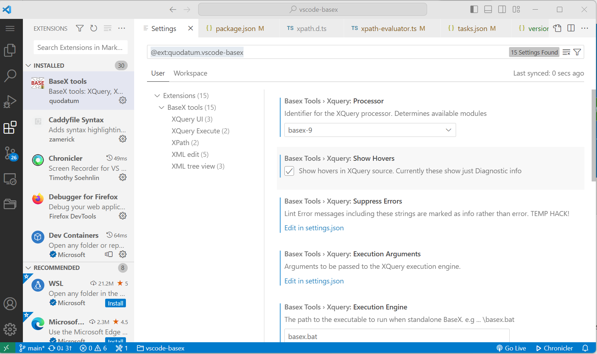

# Settings (15)
Settings can be viewed and set from the extensions view.

## XQuery
### processor	
The XQuery processor. Determines syntax and core module libraries.

default: `basex-9`

### showHovers
Show hovers in XQuery source. Currently these show just Diagnostic info.

default: `false`

### suppressErrors
Lint Error messages including these strings are marked as info rather than error. 
TEMP HACK!	[XQST0059],[XPST0008]

### executionArguments
Arguments to be passed to the XQuery execution engine.

### executionEngine
The path to the executable to run when standalone BaseX. e.g ... \basex.bat	

## XPath
### ignoreDefaultNamespace	
Ignore default xmlns attributes when evaluating XPath.

default: `true`

### persistXPathQuery	
Remember the last XPath query used.

default: `true`

## XML
### enforcePrettySelfClosingTagOnFormat
Enforces a space before the forward slash at the end of a self-closing XML tag.

default: `false`

### removeCommentsOnMinify	
Remove XML comments during minification.

default: `false`

### splitAttributesOnFormat	
Put each attribute on a new line when formatting  Overrides `splitXmlnsOnFormat` if set to `true`.

default: `false`

### splitXmlnsOnFormat	
Put each xmlns attribute on a new line when formatting XML.

default: `true`

### FormatterImplementation	
Supported XML Formatters: 
* classic	
* v2

## XML Treeview
### enableTreeView	
Enables the XML Document view in the explorer for XML documents.

default: `false`

### enableViewMetadata
Enables attribute and child element counts in the XML Document view.

default: `true`

### enableViewCursorSync
Enables auto-reveal of elements in the XML Document view when a start tag is clicked in the editor.

default: `false`