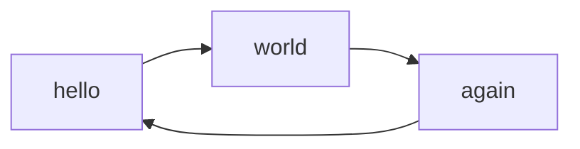

The documentation website uses [mkdocs-material](https://github.com/squidfunk/mkdocs-material) with
[mike](https://github.com/jimporter/mike) for versioning. 
Docker is used to package the documentation tools. This can be built using the supplied Dockerfile. 
```
docs\mkdocs-docker>docker build -t mkdocs-mike . --no-cache --pull
```
 `docs\run-docker.bat` will drop into a Unix bash shell.
```
git config --global --add safe.directory /usr/src/myap
git config --global user.name "Andy Bunce"
git config --global user.email "bunce.andy@gmail.com"

mike set-default 0.2 --ignore-remote-status
mike deploy 0.2 --ignore-remote-status
mike serve
```
# General
!!! note
    currently this page is just used to test mkdocs features.

* Gif images are 960x540

# Highlighting samples
## Javascript
```javascript
/* eslint-disable @typescript-eslint/no-var-requires */

const XQLint =require("@quodatum/xqlint").XQLint;
const CodeFormatter=require( "@quodatum/xqlint").CodeFormatter;
console.log("....");
const xquery="2 +4 ";
const linter = new XQLint(xquery, { "styleCheck": false }) ;

//if(linter.hasSyntaxError()+linter.hasSyntaxError()) throw new Error("XQuery syntax error")
const ast=linter.getAST()
const formatter = new CodeFormatter(ast);
const formatted = formatter.format().trim();
console.log(formatted);
```

## XML
```xml
<note id="note1">
<to>Tove</to>
<from>Jani</from>
<heading>Reminder</heading>
<body>Don't forget me this weekend!</body>
</note>
```

# XQuery
```xquery
(:~
create xqdoc from parse tree 
 @Copyright (c) 2022 Quodatum Ltd
 @author Andy Bunce, Quodatum, License: Apache-2.0
 @TODO refs
:)
 module namespace xqdc = 'quodatum:xqdoca.model.xqdoc';

import module namespace xqcom = 'quodatum:xqdoca.model.comment' at "comment-to-xqdoc.xqm";
declare namespace xqdoc="http://www.xqdoc.org/1.0";

```

# Mermaid

