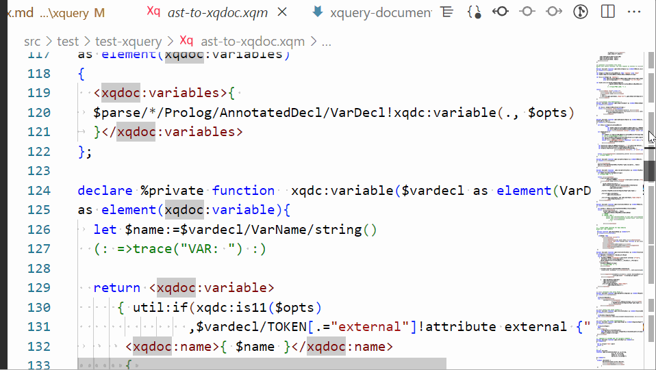

# XQuery
## Working with XQuery sources
Available features include:

* [Linting](xquery-linting.md)
* [Code completion](xquery-code-completion.md)
* [Code folding](xquery-code-folding.md)
* [Linked documents](xquery-documentlinks.md)
* [Snippets](xquery-snippets.md)
* [Source formatting](xquery-source-formating.md)
* [Symbols](xquery-symbols.md)

## Running XQuery
* [Run XQuery code](xquery-script-execution.md)
## BXS scripts
* recognized but not otherwise handled yet.
## Extension debugging
Virtual documents showing the XML parse tree and the XQDoc data can be created when the active document is
of type XQuery. These may help analysing problems with the extension.

