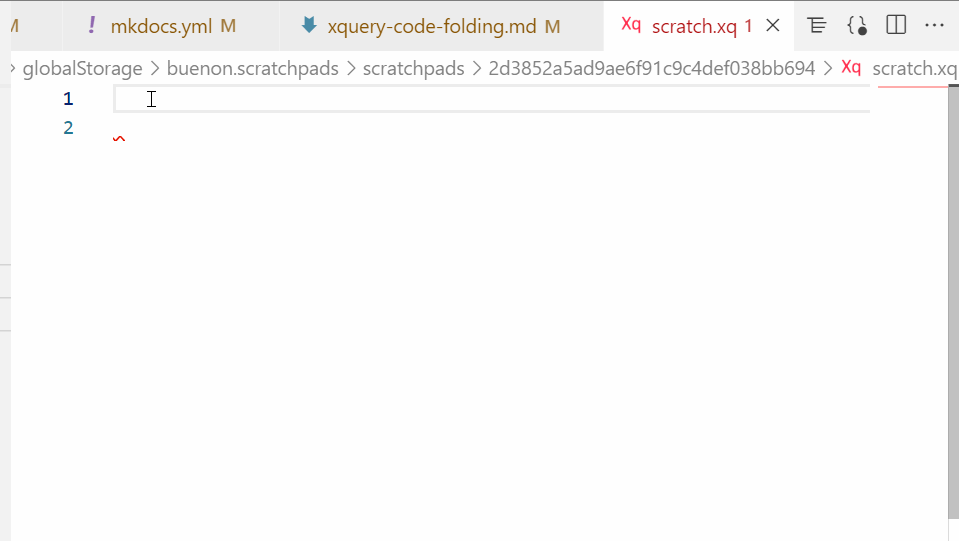

!!! note
    Currently starts new basex instance and passes file path to it.
    See [vscode-xquery-notebook](https://github.com/Quodatum/vscode-xquery-notebook) for an experimental execution using the basex client and notebook features.